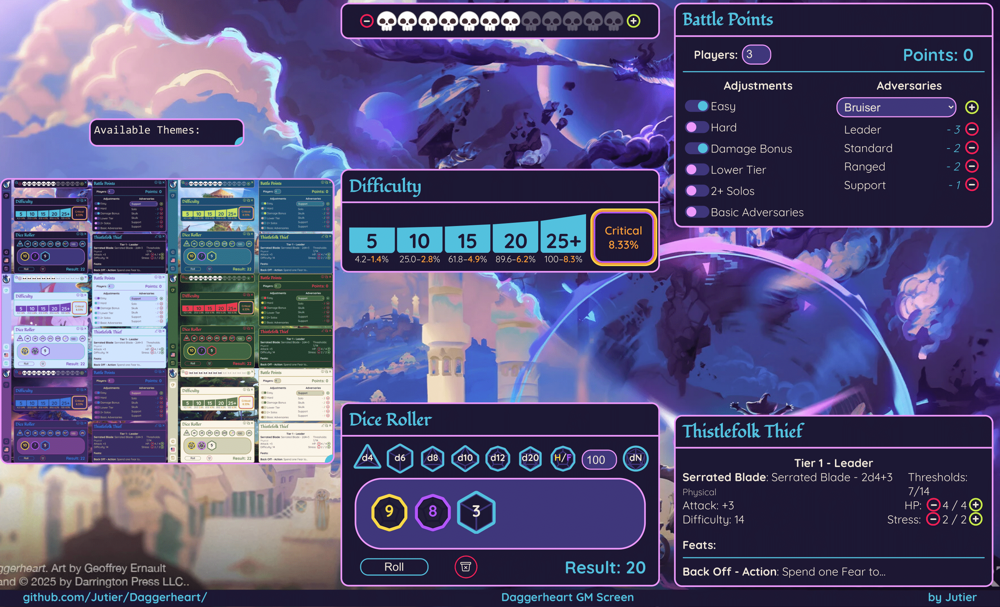

# Daggerheart GM Screen

[](https://jutier.github.io/Daggerheart/)




> This app is not a ready-made GM screen, but rather a simple way for you to create your own.

---

## Usage

You can access the app [here](https://jutier.github.io/Daggerheart/).

There you'll find a tutorial, but to maintain completeness, I'll be brief:  
Simply pick from a variety of different cards and place them wherever you like.  
That's about it!

---

## Local Usage

If you want to run the project locally for development or contribution:  
You'll need [Node.js](https://nodejs.org/) (version 18 or above).

```bash
git clone https://github.com/Jutier/Daggerheart.git
cd Daggerheart
npm install
npm run dev
```

Then open your browser at the address shown in your terminal.

---

## Features

1. There is a great variety of cards: Dice Roller, BP Calculator, Fear Tracker, and more.  
2. Move cards around as you like.
3. Change the app's theme — select from 6 options.
4. Select your preferred language (currently EN/PT).
5. No login or data collection.
6. Save your board locally, on your browser or device.
7. Responsive UI for smaller devices.


### Planned Updates

Some features I'll be adding as I find time to work on them.

- [x] Countdown Card (v1.1.0)
- [ ] Homepage with latest updates
- [ ] Multiple Boards stored in localStorage
- [ ] Automatic Board saving
- [ ] Character / Party Tracker
- [ ] Revisit Card repositioning (drag and drop?)
- [ ] Show "with Hope/Fear" on Dice Roller
- [ ] Markdown or BBCode support (Text Card)
- [ ] Better tutorials (video), covering minor undocumented features
- [ ] Additional languages
- [ ] New, simpler way to share feedback
- [ ] Add and share community Adversary blocks

Most of these came from user feedback (thank you, keep them coming!).

---

## Supporting

If you wish to help the project, you can share your impressions, request new features, help with translations, or support me directly through [Ko-Fi](https://ko-fi.com/jutier).

[](https://ko-fi.com/U7U81ILZVJ)

---

## License

This product includes materials from the Daggerheart System Reference Document 1.0 (SRD), © Critical Role, LLC.  
Used under the terms of the Darrington Press Community Gaming License (DPCGL).  
More information and the full license are available at:  
https://www.daggerheart.com

There are no previous modifications by others.

This project is not affiliated with, endorsed, or sponsored by Critical Role Productions LLC or Darrington Press.

---


